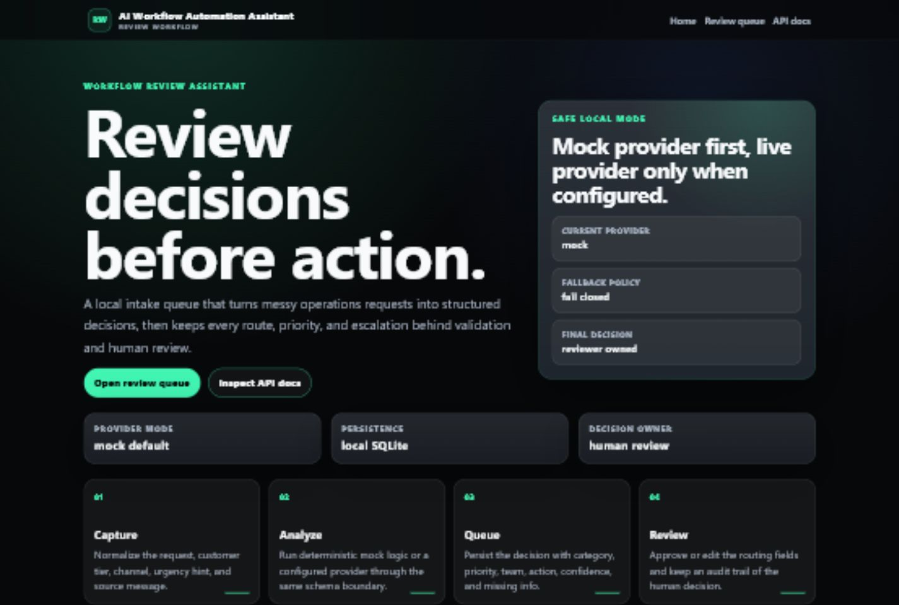
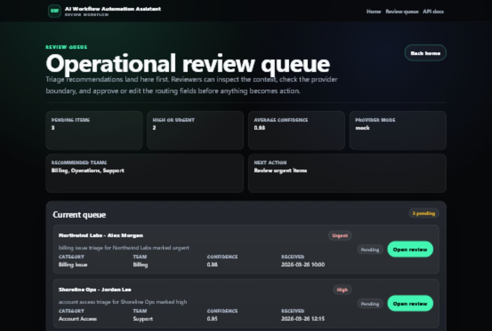
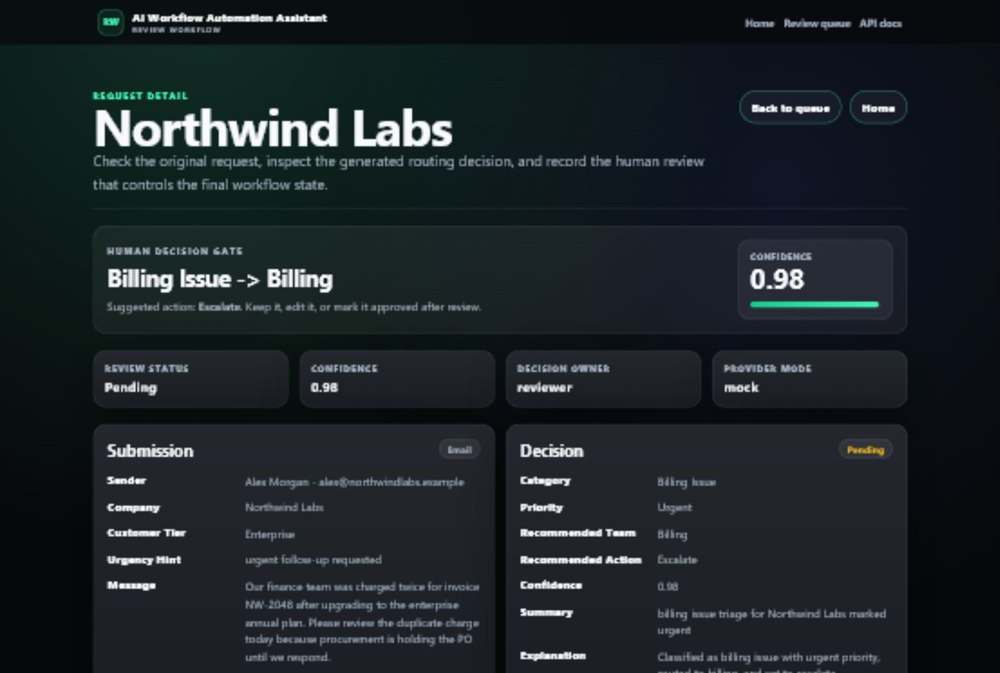

# AI Workflow Automation Assistant

Local-first workflow review assistant for intake triage, structured routing decisions, and human review preparation.

This repository is built as a compact portfolio project: the provider is optional, validation and persistence are visible, and reviewers keep control of the final workflow state.

## How It Works

This project accepts semi-structured operations requests, runs deterministic preprocessing, optionally calls an OpenAI-backed provider, validates the structured output, persists the result, and exposes an operational review queue.

The main design goal is simple: use AI inside a controlled workflow, not as the owner of business state.

## Why It Exists

- shows applied AI usage inside a reviewable operations workflow
- keeps deterministic validation, persistence, and fallback behavior visible
- demonstrates provider abstraction instead of hard-coding model logic into the app
- includes API, reviewer UI, SQLite persistence, synthetic data, and tests in one repo

## Practical Impact

The useful workflow is not "ask a model for a decision." It is: capture a messy operations request, normalize it, create a structured recommendation, keep the evidence visible, and let a reviewer approve or correct the route before work moves forward.

In practice, the demo replaces a manual inbox scan with a repeatable review artifact:

- one queue item per request
- category, priority, recommended team, action, confidence, and missing information
- provider metadata and validation boundary
- editable human review state and review history

## Reviewer Proof

- **Problem:** operational requests arrive as messy text, but routing decisions need validation, persistence, and human ownership.
- **First command:** `powershell -ExecutionPolicy Bypass -File .\scripts\run_demo.ps1`
- **Proof artifact:** seeded synthetic operations requests in a local SQLite database, visible through the review queue and request-detail pages.
- **Visual proof:** `docs/screenshots/home.png`, `docs/screenshots/queue.png`, `docs/screenshots/request-detail.png`, and `docs/screenshots/queue-mobile.png`.
- **Validation:** 28 pytest tests plus `ruff check .` cover API contracts, provider behavior, parsing, health, and review flow.
- **Current limitation:** the default demo uses the mock provider; live OpenAI mode is optional and should be used only with explicit local configuration.

## Implemented Surfaces

- `POST /api/v1/requests` to submit and analyze a request
- `GET /api/v1/requests/{request_id}` to inspect one request and its decision
- `GET /api/v1/queue` to list pending queue items
- `POST /api/v1/requests/{request_id}/review` to approve or edit a workflow decision
- `GET /health` for service health
- reviewer UI surfaces for queue and request detail review
- `mock` and `openai` provider modes behind a provider boundary
- local SQLite persistence for demo and development
- automated test coverage for API, parsing, health, and provider behavior

## Demo Screenshots

| Landing page | Review queue |
| --- | --- |
|  |  |

| Request detail |
| --- |
|  |

## Reviewer Walkthrough

For a local reviewer walkthrough:

1. Run the app in mock provider mode.
2. Seed synthetic operations requests with `python scripts/seed_demo.py`.
3. Open `/queue` to inspect configuration, test-failure, SQL validation, and handover-review items.
4. Open a request detail page to inspect the generated decision, edit routing fields if needed, and save a human review action.

The important boundary is visible in the flow: model output is parsed and validated, but the stored workflow state remains reviewable and editable before business action.

## One-Command Local Demo

For a repeatable reviewer demo, run:

```powershell
powershell -ExecutionPolicy Bypass -File .\scripts\run_demo.ps1
```

The script installs the project, runs lint/tests, starts the app in safe `mock` provider mode, seeds synthetic requests, and prints the landing and queue URLs. It uses `.local/demo_workflow_assistant.db` so the demo state stays local and ignored.

The demo proves the useful workflow end to end:

```text
messy operations request -> normalized recommendation -> queue item -> request detail -> human review
```

Use this path for portfolio review because it does not require an API key and does not send sample data to an external provider.

## Technical Stack

- Python 3.11+
- FastAPI
- SQLAlchemy
- Pydantic
- Jinja2
- SQLite
- OpenAI Python SDK
- Docker
- GitHub Actions

## Local Run

1. Create and activate a virtual environment.
2. Install dependencies:

```bash
pip install -e .[dev]
```

3. Copy `.env.example` to `.env`.
4. Start the app:

```bash
uvicorn app.main:app --reload
```

5. Open `http://127.0.0.1:8000`

Main local surfaces:

- `/` for the landing page
- `/queue` for the reviewer queue
- `/requests/{request_id}` for request detail and review history

To populate the local queue with sanitized demo data, keep the app running and execute:

```bash
python scripts/seed_demo.py
```

For a containerized local run:

```bash
docker compose up --build
```

Docker Compose runs in mock provider mode by default, so a first run does not require a real API key. Use `.env` only when you intentionally want to configure the optional OpenAI provider path.

## Provider Modes

- `mock`
  - safest local default for demos and tests
- `openai`
  - real provider path with structured output validation

The OpenAI path is intentionally optional. The workflow should still be understandable and testable when the provider is mocked.

When `openai` mode is enabled, submitted intake text and metadata are sent to the configured provider for analysis. Use synthetic or approved data only, and keep `mock` mode as the default for portfolio demos, tests, and screenshots.

## Example Workflow

1. Submit an intake request through the API or starter UI.
2. Normalize and validate the input.
3. Run provider-backed or mock decision generation.
4. Validate the structured response.
5. Persist request, decision, and review state to SQLite.
6. Review the result in the queue or request-detail view.

## Quality Checks

```bash
ruff check .
pytest
```

Repository validation also includes GitHub Actions CI for:

- linting
- test execution
- synthetic demo/eval fixture validation
- Docker build verification
- container health smoke test

## Repository Layout

- `app/`
  - API, core app wiring, providers, repositories, services, templates, and UI routes
- `docs/`
  - architecture and project notes
- `sample_data/`
  - sanitized operations-style demo requests
- `evals/`
  - evaluation-oriented sample cases
- `scripts/`
  - developer utilities, including the local demo seeding helper
- `tests/`
  - API, provider, parser, and health checks

## Documentation

- [docs/architecture.md](docs/architecture.md)
- [docs/README.md](docs/README.md)
- [sample_data/README.md](sample_data/README.md)
- [SECURITY.md](SECURITY.md)

## Current Limits

- no authentication or multi-user access control yet
- single-tenant local-demo posture only
- local SQLite is suitable for development, not as a production database strategy
- Docker support is for local packaging, not a full deployment platform
- screenshots cover the local review flow, but this is not a hosted production service

## Public Repo Notes

- do not commit a real `.env` file
- do not commit populated runtime databases or local state under `.local/`
- do not present this as production-ready without auth, stronger deployment controls, and a production database plan
- treat the OpenAI path as optional and bounded, not as the authoritative core of the workflow
- committed sample data uses synthetic `.example` email domains only
